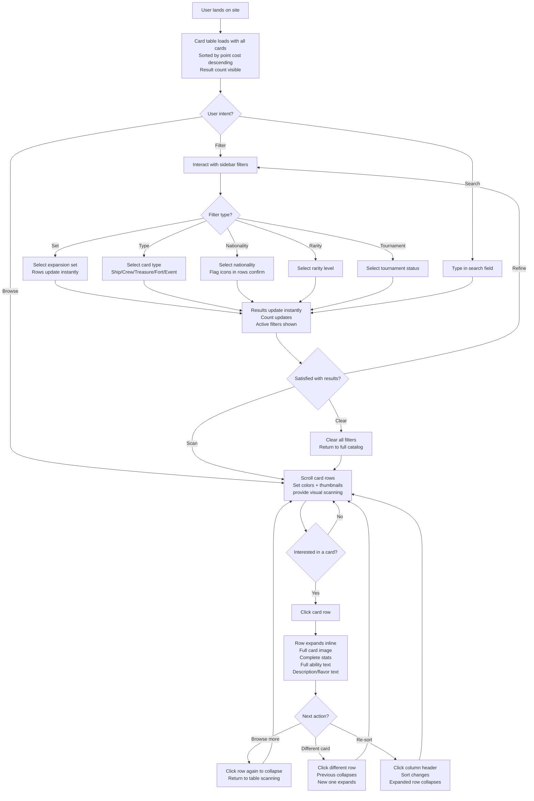
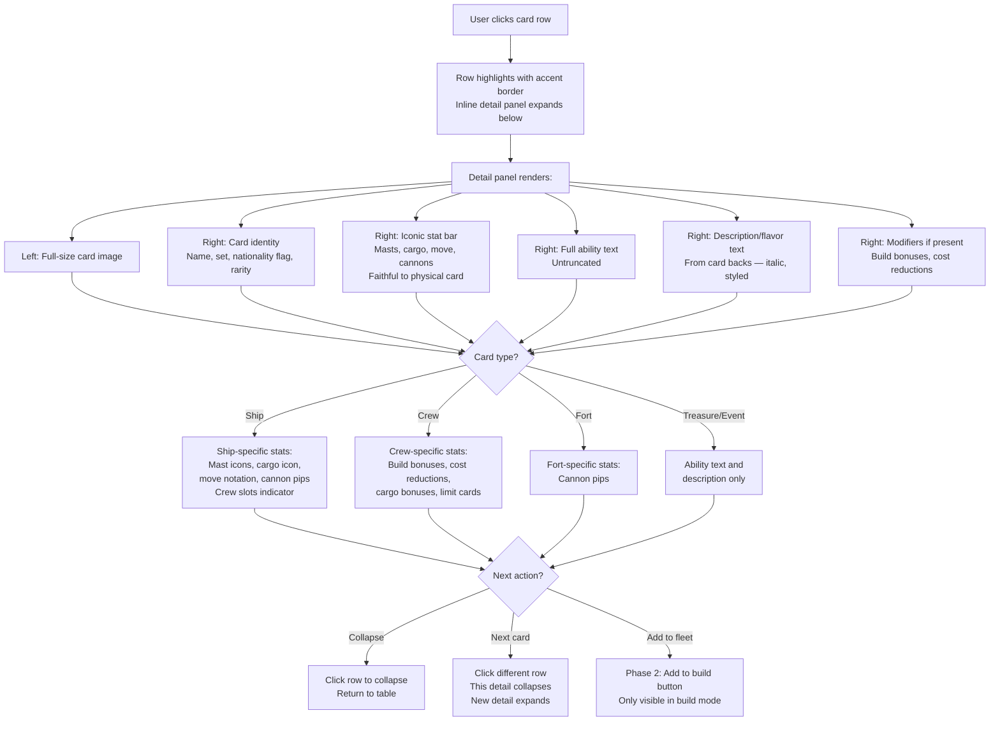
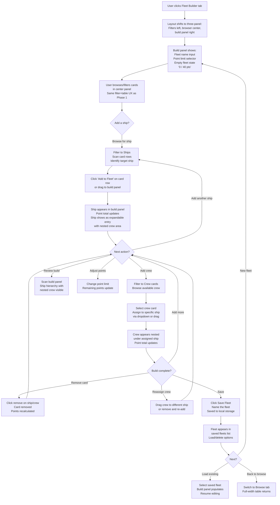
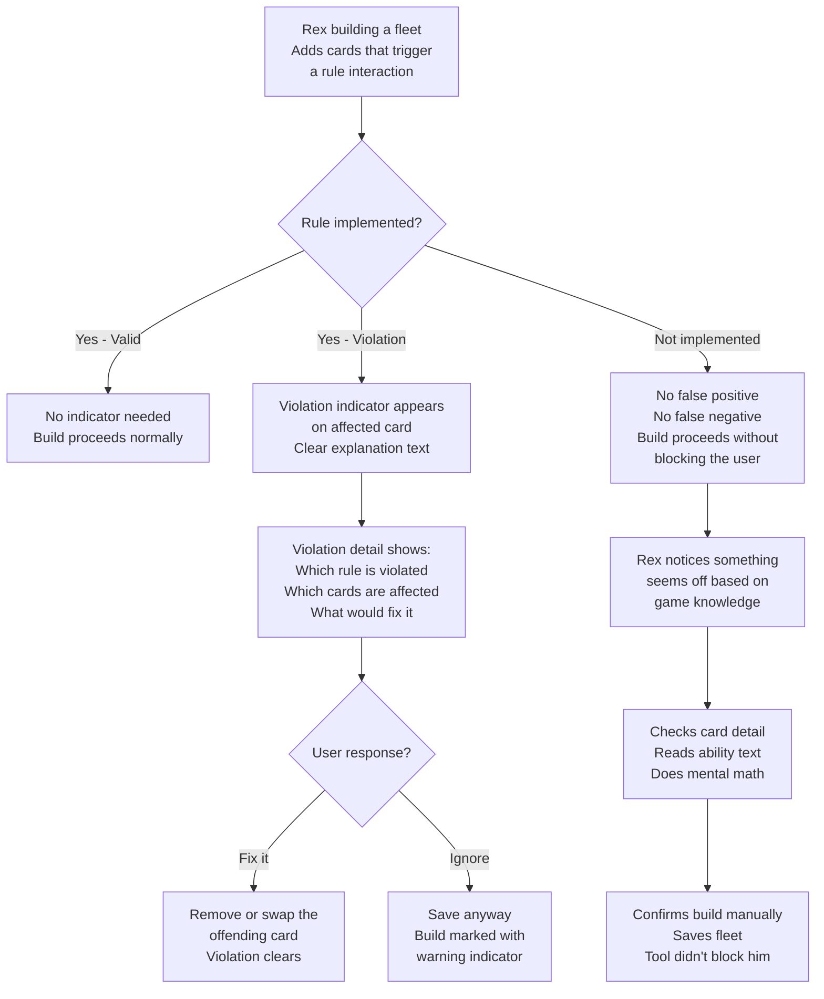

# UX Design Specification PiratesWeb

**Author:** Captain
**Date:** 2026-02-26

---

## Executive Summary

### Project Vision

PiratesWeb brings a 2005 Windows-only deck builder into the modern web as a static Svelte/SvelteKit application — zero install, zero accounts, zero friction. It serves a Pirates CSG fan community that has had no modern tooling for over a decade, delivering a "holy crap, someone actually made this" moment through faithful card data, original artwork, and a rules-aware fleet builder. The complete data asset (5000+ cards, 424 images, 3 expansion sets) and deep domain knowledge of the original developer give this project an authenticity no competitor can match — because no competitor exists.

### Target Users

**Captain Rex (Veteran Player):** Experienced Pirates CSG player driven by nostalgia and the joy of a well-built fleet. Browses cards to rediscover favorites, tinkers with fleet builds, and values stat-dense, scannable layouts. Desktop-primary, tech-comfortable, expects snappy filtering and accurate data.

**Trader Anne (Casual Collector):** Appreciates Pirates CSG cards as collectibles. Browses by set, rarity, and type with emphasis on card artwork and ability text. Less interested in fleet building, more interested in visual exploration and discovering cards she's never seen. May browse casually on multiple devices.

### Key Design Challenges

- **Information density vs. visual appeal** — Balancing a stat-dense table layout (efficient for veteran players scanning builds) with the emotional impact of 424 original card images (the hook that draws users in and triggers sharing).
- **Card type heterogeneity** — Ships, Crew, Treasure, Forts, and Events have fundamentally different stat profiles. The browse layout must handle varying column relevance without clutter or confusion.
- **Honoring physical card conventions** — Players carry strong mental models from the physical game: point cost placement, set color-coding, nationality flags, S/L cannon notation, stat bar ordering. The digital experience should feel familiar without being a direct skeuomorphic replica.
- **Nested fleet hierarchy (Phase 2)** — Fleet builds are ship-centric with crew assigned underneath. The UX must support both visual scannability (like the legacy print layout) and interactive manipulation (add, remove, reassign).

### Design Opportunities

- **Set color-coding as navigation** — Row backgrounds color-coded by expansion set (Spanish Main, Crimson Coast, Revolution) provide instant visual provenance — users see at a glance which release a card belongs to. Nationality is expressed through flag icons, serving gameplay identity distinct from set origin.
- **Dual-mode card viewing** — Table-first default for scanning, with rich detail expansion for card artwork and full stats. Serves both personas without forcing a choice.
- **Visual stat language** — Render cannon types (S/L), masts, and other stats using compact visual indicators inspired by the physical cards, making the interface instantly readable to anyone who played the game.

## Core User Experience

### Defining Experience

The core experience of PiratesWeb is **filtering and scanning cards in a browse table modeled after the legacy build sheet layout**. Both personas begin here — Rex filtering to find ships for a fleet, Anne browsing sets to discover cards. The card row format mirrors the physical game's information hierarchy: point cost dominant on the left, card thumbnail, name, inline stat icons (masts, cargo, move, cannons as S/L), and ability text — all on an expansion-set color-coded background with nationality expressed via flag icons. This format is already deeply familiar to Pirates CSG players and requires no learning curve.

### Platform Strategy

- **Primary platform:** Desktop web browser (Chrome, Firefox, Safari, Edge)
- **Input model:** Mouse and keyboard — hover states, click interactions, keyboard-navigable filters
- **Architecture:** Static site (SvelteKit + adapter-static), entirely client-side, no server dependency
- **Offline:** Not required — static assets cache well via browser, but no explicit offline mode
- **Mobile:** Functional but not optimized — the table-oriented layout is desktop-native by design
- **Performance:** All card data bundled as JSON at build time; filtering is in-memory and must feel instant

### Effortless Interactions

- **Filtering to a subset** — Applying set, type, nationality, rarity, or text search filters must update results with no perceptible delay. Combining filters should feel natural and reversible.
- **Scanning card rows** — The build-sheet-inspired row format means users absorb point cost, nationality, stats, and ability at a glance without clicking into a detail view. The table IS the experience for most interactions.
- **First-visit orientation** — The layout must telegraph its purpose instantly: filters on one side, cards on the other, no onboarding required. A Pirates CSG fan should recognize what they're looking at within seconds.
- **Card detail access** — Expanding a row or opening a panel to see the full card image and complete stats should be a single click with no page navigation, keeping the user in browsing flow.

### Critical Success Moments

- **The "holy crap" moment (first 10 seconds)** — User lands on the site, sees familiar card imagery and set colors, and immediately understands this is a real, complete tool. This moment determines whether they bookmark or bounce.
- **First successful filter** — User applies a filter (e.g., "English Ships from Spanish Main") and sees correct, fast results with recognizable cards. Trust is established.
- **Point cost at a glance** — When browsing or building, the point value is the loudest element on every card row. Users never have to hunt for it. This is critical for fleet building (Phase 2) where point math drives every decision.
- **Card recognition** — Seeing a thumbnail and stats rendered in the build-sheet format and immediately recognizing a card from the physical game. The layout honors the game's visual language, not a generic database.

### Experience Principles

1. **Points are king** — Point cost is the most prominent element in every card representation. It drives fleet building and is the first thing veteran players look for.
2. **Honor the physical game** — Set color-coding, nationality flags, stat notation (S/L cannons), and information hierarchy follow the conventions established by the physical cards and legacy app. Don't reinvent what players already know.
3. **Filter fast, scan faster** — The primary interaction loop is filter → scan → refine. Every step must feel instant. The table row format packs enough information that most questions are answered without opening a detail view.
4. **Zero-friction entry** — No signup, no tutorial, no onboarding. The interface is self-evident to anyone who knows Pirates CSG. For those who don't, the layout is still a clear browse-and-filter tool.

## Desired Emotional Response

### Primary Emotional Goals

- **"Holy crap, someone actually made this"** — The defining emotional moment. Users arrive with low expectations and encounter a polished, complete tool with real card images. The gap between expectation and reality creates an emotional peak that drives sharing and bookmarking.
- **Confidence through familiarity** — The interface speaks Pirates CSG fluently. Point costs are prominent, S/L cannon notation is intact, nationality flags are recognizable, set colors orient the user. Veterans feel the tool was made by someone who knows the game — because it was.
- **Impressed by the polish** — This isn't a hobby project that looks like a hobby project. The visual presentation, responsiveness, and information design should communicate craft and care. Users should feel they're using something well-made.

### Emotional Journey Mapping

| Stage                                  | Emotion                     | Design Driver                                                                      |
| -------------------------------------- | --------------------------- | ---------------------------------------------------------------------------------- |
| **Discovery** (BGG link click)         | Curiosity, low expectations | "Someone made a deck builder?" — skepticism is the baseline                        |
| **First impression** (site loads)      | Surprise, recognition       | Card images load, set colors appear, layout is clean and polished — this is real   |
| **First interaction** (apply a filter) | Confidence, delight         | Results appear instantly, cards are correct, the tool responds like it should      |
| **Deep browsing** (scanning rows)      | Satisfaction, nostalgia     | Familiar stat layouts, point costs prominent, flags and set colors orient scanning |
| **Card detail** (expand/click)         | Appreciation, discovery     | Full card art, complete stats — seeing a card you remember rendered beautifully    |
| **Return visit**                       | Comfort, ownership          | "My tool" — bookmarked, trusted, part of their Pirates CSG routine                 |

### Micro-Emotions

- **Confidence over confusion** — Every element should be immediately understandable to a Pirates CSG player. No ambiguous icons, no mystery controls.
- **Trust over skepticism** — Accurate data, correct images, faithful stat representation. If a veteran spots an error, trust breaks instantly.
- **Delight over mere satisfaction** — The polish level should exceed expectations for a community tool. Small touches (smooth filtering, clean typography, well-rendered stat icons) compound into a feeling of quality.
- **Nostalgia without kitsch** — The card images and game data carry the nostalgia. The UI itself should be modern and clean, not decorated with faux-parchment textures or pirate fonts. Let the content evoke the memories; let the interface stay out of the way.

### Design Implications

- **"Polished and impressive" → clean modern UI** — The interface should feel contemporary and well-crafted. Quality typography, considered spacing, smooth interactions. The pirate theme lives in the content (card images, set colors, flags), not in decorative UI chrome.
- **Set color-coded backgrounds → visual provenance** — Row backgrounds indicate expansion set (Spanish Main, Crimson Coast, Revolution), giving users an instant visual signal of card origin. This is a scanning aid, not decoration.
- **Nationality flags → gameplay identity** — Nationality is expressed through flag icons on card rows, distinct from set color coding. Flags serve filtering and fleet-building context.
- **Instant filtering → "this tool is fast"** — Perceived performance is an emotional lever. Filters that update without perceptible delay create a feeling of power and control.
- **Data accuracy → unspoken trust** — Every stat, every image mapping, every ability text must be correct. Trust is built silently through accuracy and broken loudly by a single wrong data point.

### Emotional Design Principles

1. **Polish signals respect** — A well-crafted interface tells the community "your game deserves a good tool." Visual quality is an emotional statement, not just an aesthetic choice.
2. **Content carries the nostalgia** — Card images, set colors, nationality flags, and familiar stat notation evoke the game. The UI framework stays modern and clean — no faux-pirate theming.
3. **Speed is a feeling** — Instant filter response and smooth transitions create a sense of power and competence. Perceived performance is as important as actual performance.
4. **Accuracy is trust** — Every correct data point builds silent trust. Every error breaks it. The emotional foundation of the entire product rests on data fidelity.

## UX Pattern Analysis & Inspiration

### Inspiring Products Analysis

**Scryfall (Magic: The Gathering card search)** — The benchmark for card game browsers. Demonstrates that a single powerful search bar, instant filtering, and clean modern UI (no fantasy chrome) creates an experience that serves both casual browsers and power users. Their image grid / list view toggle proves dual-mode viewing works for card game tools.

**Archidekt / Moxfield (MTG deck builders)** — Best-in-class deck building UX. Split-panel layout (browser + build) enables simultaneous browsing and building. Running totals always visible. Cards categorized within builds (by type). Low-friction add/remove. Directly applicable to PiratesWeb's fleet builder (Phase 2) where ships with nested crew mirror MTG's categorized deck lists.

**BoardGameGeek** — The platform our users arrive from. Establishes the baseline expectation: tabletop gamers are comfortable with dense data tables, powerful filtering, and information-rich layouts. Validates our table-first approach and confirms that our audience does not need oversimplified UIs.

### Transferable UX Patterns

**Navigation Patterns:**

- **Filter bar + results table** (Scryfall/BGG) — Filters visible and always accessible alongside results. Active filters clearly indicated with individual clear controls. Direct fit for card browse.
- **Split-panel browse+build** (Archidekt/Moxfield) — Card browser and fleet build visible simultaneously. Essential for Phase 2 fleet builder.

**Interaction Patterns:**

- **Instant filter response** (Scryfall) — Results update with no perceptible delay as filters change. Critical for the "filter fast, scan faster" principle.
- **View mode toggle** (Scryfall) — Switch between image-rich grid and data-dense list. Serves both Captain Rex (list scanner) and Trader Anne (image browser). Consider for future enhancement.
- **Running totals always visible** (Archidekt) — Point total, card count, and limit indicators persistently displayed during fleet building. Never hidden behind a click.

**Visual Patterns:**

- **Card images as primary visual anchor** (Scryfall) — Even in list view, card thumbnails are present. The image is the recognition hook.
- **Clean UI, content carries the theme** (Scryfall) — Modern, unthemed interface chrome. The cards themselves provide all the visual personality needed.
- **Smooth virtual scroll over pagination** (Scryfall) — Continuous scrolling through large result sets maintains browsing flow.

### Anti-Patterns to Avoid

- **Hidden stats behind clicks** — Some card tools minimize visible data for "clean" aesthetics. For Pirates CSG veterans, stats are the content. Never hide point cost, masts, cannons, or cargo behind an extra interaction.
- **Mandatory onboarding or tutorials** — Users arrive from a BGG link expecting to browse immediately. Any gate between landing and seeing cards is a bounce risk.
- **Fantasy-themed UI chrome** — Parchment textures, pirate fonts, rope borders, and treasure map backgrounds are fatiguing. The 424 card images and set colors provide all the thematic richness needed. Keep the interface modern and clean.
- **Pagination for card results** — Clicking through pages breaks scanning flow and disrupts the filter-scan-refine loop. Virtual scrolling or progressive loading maintains momentum.
- **Overloaded filter UI** — Exposing every possible filter simultaneously creates visual noise. Present primary filters (set, type, nationality) prominently; secondary filters (rarity, tournament status) accessible but not competing for attention.

### Design Inspiration Strategy

**What to Adopt:**

- Scryfall's instant filtering and clean-chrome-with-rich-content approach — directly supports our "polished and impressive" emotional goal
- Archidekt's split-panel browse+build layout — the right model for Phase 2 fleet builder
- BGG-level information density — our audience expects and prefers data-rich interfaces

**What to Adapt:**

- Scryfall's view toggle (grid/list) — our primary view is the build-sheet-inspired table row, but a future card gallery mode could serve Trader Anne's browsing style
- Archidekt's categorized build view — adapt for ship-centric hierarchy with nested crew rather than card type categories

**What to Avoid:**

- Any fantasy/pirate UI theming on the interface chrome — content carries the theme
- Pagination in any form — use virtual scroll or progressive rendering
- Stats hidden for aesthetics — information density is a feature, not a problem to solve

## Design System Foundation

### Design System Choice

**Tailwind CSS + DaisyUI** — Utility-first CSS framework with a semantic component plugin, running on Svelte/SvelteKit.

Tailwind provides fine-grained control over every visual detail. DaisyUI layers semantic component classes (`btn`, `card`, `table`, `modal`, `dropdown`) on top, accelerating standard UI elements while preserving full Tailwind customization underneath.

### Rationale for Selection

- **Custom card row layout demands full control** — The build-sheet-inspired card row (set-colored background, prominent point cost, inline stat icons, nationality flags, thumbnail) is the defining UI element and doesn't exist in any component library. Tailwind's utility classes make this buildable without fighting framework opinions.
- **DaisyUI accelerates standard components** — Filter dropdowns, buttons, modals (Phase 2 fleet builder), and form controls are standard UI patterns. DaisyUI provides these out of the box with consistent styling and theming, reducing boilerplate.
- **"Polished and impressive" requires visual precision** — Spacing, typography, color, and transitions need to be dialed in. Tailwind's design token system (spacing scale, color palette, typography scale) enforces consistency while enabling pixel-level control.
- **Solo developer efficiency** — No component library overhead to learn or debug. Tailwind's utility classes are self-documenting in markup. DaisyUI's semantic classes reduce verbosity for standard elements.
- **Svelte-native integration** — Tailwind integrates cleanly with SvelteKit's build pipeline. No framework-specific wrapper libraries needed. DaisyUI is a pure Tailwind plugin with no JavaScript runtime.
- **Themeable** — DaisyUI's theme system supports custom color palettes, which will be useful for defining the set color-coding (Spanish Main, Crimson Coast, Revolution background colors) as design tokens.

### Implementation Approach

- **Tailwind config** as the single source of truth for design tokens: colors (set backgrounds, UI chrome), spacing, typography, breakpoints
- **DaisyUI theme** customized with PiratesWeb's color palette — clean, modern base with set colors defined as named tokens
- **Custom Svelte components** for domain-specific elements: CardRow, CardDetail, StatBar, CannonIndicator, NationalityFlag, PointBadge
- **DaisyUI components** for standard UI: filter dropdowns, buttons, modals, tooltips, navigation
- **Responsive utilities** via Tailwind breakpoints — desktop-first with functional mobile fallback

### Customization Strategy

- **Color system:** Define expansion set colors (Spanish Main, Crimson Coast, Revolution) as custom Tailwind/DaisyUI theme colors. Define nationality flag assets. Define a clean neutral palette for UI chrome.
- **Typography:** Clean sans-serif system font stack for the interface. No decorative or themed fonts. Establish a clear type scale for card names, stat values, ability text, and UI labels.
- **Spacing:** Consistent spacing scale for card row padding, stat icon sizing, filter bar layout. Dense but readable — information-rich without feeling cramped.
- **Component overrides:** DaisyUI components styled to match the clean, modern aesthetic — no default theme colors leaking through. Buttons, dropdowns, and modals should feel cohesive with the custom card row design.

## Defining Core Interaction

### Defining Experience

**"Filter to find it, scan to know it."**

A Pirates CSG fan selects "English Ships" or types "HMS" and instantly sees a filtered list of build-sheet-style card rows — point costs prominent, stats inline, set colors orienting, thumbnails triggering recognition. The answer to their question is in the table without clicking further. When they do click, they get the full card image, complete ability text, and the flavor description from the card backs — a reward for curiosity.

This is PiratesWeb's core loop: filter → scan → optionally expand. It's what users will describe to friends: "There's this site where you can look up any Pirates CSG card with the actual images and all the stats."

### User Mental Model

**What users bring to this tool:**

- **Physical card layout** — Point cost top-left, stats in a bar, ability text in a box, nationality via flag. 20 years of muscle memory.
- **Legacy build sheet format** — Compact horizontal rows with set-colored backgrounds, thumbnails, inline stats. Users who used the original app will recognize this immediately.
- **Spreadsheet-based lookup** — The community's current solution is a fan-made Excel spreadsheet with card data (broader set coverage but no images, no build-sheet presentation, no polish). Users already think in terms of filter columns and sort orders.
- **Sort by points** — Veterans naturally think about cards in terms of cost. Default sort by point value matches how players evaluate cards for fleet building.

**Mental model implications:**

- The table is not a compromise — it's what users expect and prefer
- Sorting and filtering are not advanced features — they're the baseline expectation from spreadsheet experience
- Card images are the differentiator — the spreadsheet doesn't have them, and they're what triggers the emotional response
- The description/flavor text is bonus content most users have never read digitally — it adds discovery value to the detail view

### Success Criteria

- **Filter response feels instant** — No perceptible delay between applying a filter and seeing updated results. Users coming from Excel expect immediate response.
- **Default sort by point cost** — The most natural ordering for both browsing and building. All columns should be sortable for users who want different views.
- **Card row answers most questions** — Point cost, name, type, nationality flag, and key stats (masts, cargo, move, cannons for ships) visible without expanding. Users should rarely need to click for basic lookup.
- **Expanded view rewards clicking** — Full-size card image, complete ability text (untruncated), card back description/flavor text, and all modifiers. This is where Trader Anne's browsing experience comes alive.
- **Result count visible** — Users should always see how many cards match their current filters. "Showing 47 of 5,231 cards" provides orientation and confidence.
- **Sort state visible** — Current sort column and direction clearly indicated. Clicking a column header to sort/reverse feels natural from spreadsheet experience.

### Novel UX Patterns

**Pattern classification: Established patterns, game-native presentation.**

No novel interaction patterns are needed. The core experience uses universally understood UX: filter bar, sortable table, expandable rows. The innovation is in the _content presentation_ — rendering card data in the build-sheet format with set colors, nationality flags, and visual stat indicators rather than a generic data grid. The patterns are familiar; the personality is unique.

**Established patterns adopted:**

- Filter bar with dropdown selectors and text search (Scryfall/BGG)
- Sortable table columns with visual sort indicators (spreadsheet convention)
- Expandable row or slide-out panel for detail view (common in data-dense UIs)
- Virtual scroll for large result sets (Scryfall)

**Game-native twist:**

- Card rows styled after the legacy build sheet, not generic table rows
- Point cost as the visually dominant element (larger, bolder than other stats)
- Set color-coded row backgrounds as a scanning aid
- Nationality flags as inline icons
- Cannon notation rendered as S/L visual indicators

### Experience Mechanics

**1. Initiation — Landing on the site:**

- User arrives (likely from a BGG link) and sees the card browser immediately — no splash page, no onboarding
- Filter bar is visible and self-evident at the top or side
- Card rows are already populated (default: all cards, sorted by point cost descending)
- The set-colored rows and card thumbnails immediately signal "this is a Pirates CSG tool"

**2. Interaction — Filtering and scanning:**

- User selects filters (set, type, nationality, rarity) from dropdowns or clicks filter chips
- User optionally types in the text search field for name/ability search
- Results update instantly in the table below
- User scans card rows — point cost, name, stats, thumbnail visible at a glance
- User clicks a column header to re-sort (point cost, name, set, type, etc.)

**3. Feedback — Confirmation of success:**

- Result count updates immediately ("Showing 12 English Ships from Spanish Main")
- Active filters are visibly indicated with clear/remove controls
- Sort column and direction shown with arrow indicator
- Card rows render with set-colored backgrounds and familiar stat layout — instant recognition

**4. Completion — Finding what you need:**

- For quick lookup: the card row answers the question (stats, point cost, ability). User is done.
- For deeper exploration: user clicks/expands a row to see full card image, complete ability text, description/flavor text, and all modifiers
- For fleet building (Phase 2): user adds the card to a build from the browse view or detail view

## Visual Design Foundation

### Color System

**UI Chrome — Dark Neutral Theme:**

- **Background:** Dark gray/near-black (e.g., `#1a1a2e` or `#0f0f1a`) — deep enough to let set-colored rows and card images pop
- **Surface:** Slightly lighter dark gray (e.g., `#16213e` or `#1c1c2e`) — for cards, panels, filter bar backgrounds
- **Border/Divider:** Subtle light-on-dark separators (e.g., `#2a2a3e` or low-opacity white)
- **Text primary:** Off-white (e.g., `#e8e8e8`) — high contrast on dark background without being pure white
- **Text secondary:** Muted gray (e.g., `#a0a0b0`) — for supporting text, labels, metadata
- **Text on set backgrounds:** Will need per-set text color tuning — dark text on Tan (Spanish Main), light text on Red (Crimson Coast) and Blue (Revolution)

**Set Background Colors (from original website assets):**

- **Pirates of the Spanish Main:** Warm tan/parchment — textured canvas background (`TanBG.jpg`). Light enough for dark text.
- **Pirates of the Crimson Coast:** Deep burgundy/crimson — rich dark textured background (`RedBG.jpg`). Dark enough to require light text.
- **Pirates of the Revolution:** Royal blue — bold textured background (`BlueBG.jpg`). Dark enough to require light text.

These textured backgrounds are the actual set identity assets from the original Pirates CSG website. They should be used as card row backgrounds (tiled or stretched), preserving the authentic set-color association players recognize.

**Accent/Interactive Colors:**

- **Primary accent:** To be determined — a color that stands out against the dark chrome and doesn't clash with any of the three set backgrounds. Consider a teal/cyan or a gold/amber for interactive elements (buttons, links, active filter indicators).
- **Success/Warning/Error:** Standard semantic colors (green/amber/red) for fleet builder validation feedback (Phase 2-3). Must maintain contrast against the dark theme.

**Point Cost Highlight:**

- Point values should use a visually prominent treatment — bold weight, slightly larger size, and potentially an accent color or high-contrast badge. This is the loudest element in every card row.

### Typography System

**Typeface: Geometric sans-serif**

- **Primary font:** Inter or Plus Jakarta Sans — clean, geometric, excellent readability at small sizes on screen. Both are free, widely supported, and available via Google Fonts or self-hosted.
- **Monospace (stat values):** Consider a monospace or tabular-number font for stat columns (point cost, masts, cargo, move) so values align vertically across rows. Inter has tabular number support built in.

**Type Scale:**

- **App title/branding:** TBD (name not finalized)
- **Section headers (h2):** 1.25rem / semibold — filter panel headers, "Fleet Builder" header
- **Card name (in row):** 1rem / semibold — the primary readable element in each card row
- **Stat values:** 0.875rem / medium — inline stats (masts, cargo, move, cannons)
- **Point cost:** 1.25rem / bold — oversized relative to other row content, the loudest typographic element
- **Ability text (in row):** 0.8125rem / regular — compact but readable, may truncate with ellipsis
- **Ability text (detail view):** 0.9375rem / regular — slightly larger, full text shown
- **Filter labels:** 0.8125rem / medium — compact, clear
- **Result count / metadata:** 0.75rem / regular — small supporting text

**Line Heights:**

- Headings: 1.2–1.3
- Body text / card rows: 1.4–1.5
- Compact stat labels: 1.2

### Spacing & Layout Foundation

**Spacing System:**

- **Base unit:** 4px
- **Spacing scale:** 4px / 8px / 12px / 16px / 24px / 32px / 48px / 64px
- **Card row padding:** 12px vertical, 16px horizontal — moderate breathing room, enough to read comfortably without feeling wasteful
- **Card row gap:** 4px between rows — tight enough to scan as a list, with set-colored backgrounds providing visual separation
- **Filter bar padding:** 16px — slightly more spacious for interactive controls
- **Detail view padding:** 24px — generous spacing for the expanded card view where users are reading, not scanning

**Layout Structure:**

- **Desktop primary layout:** Sidebar filters (left) + scrollable card table (main area). Filter sidebar is collapsible.
- **Card table:** Full width of main area, virtual scroll for large result sets
- **Card row height:** ~60–72px — enough for thumbnail, name, stats on one line, and truncated ability text on a second line. Set background texture fills the full row.
- **Detail panel:** Expands below the row or slides out from the right — shows full card image, complete text, description/flavor. Does not navigate away from the table.

**Grid System:**

- No formal column grid — the layout is a two-panel structure (sidebar + main) with internal component spacing governed by the spacing scale
- Card row internals use a flexible horizontal layout: [point cost badge] [thumbnail] [name + stats] [ability text] — with consistent gaps

### Accessibility Considerations

- **Contrast ratios:** Off-white text on dark backgrounds must meet WCAG AA (4.5:1 minimum for body text). Text on set-colored row backgrounds must be tested per-set — dark text on Tan, light text on Red and Blue.
- **Focus indicators:** Interactive elements (filters, buttons, sortable column headers, expandable rows) must have visible focus rings for keyboard navigation. High-contrast focus ring against dark theme.
- **Font sizing:** Base font size of 16px (1rem) ensures readability. Stat values at 14px (0.875rem) are acceptable for short numeric content. Nothing smaller than 12px (0.75rem).
- **Color not sole indicator:** Set identity uses color backgrounds but could be supplemented with set name text. Nationality uses flags (visual icon) not color alone. Filter state uses both color and icon/text indicators.
- **No formal WCAG audit target** — but standard good practices followed throughout. The dark theme with high-contrast text and generous spacing naturally supports readability.

## Design Direction Decision

### Design Directions Explored

Seven design directions were generated and evaluated through an interactive HTML showcase (`ux-design-directions.html`):

- **A: Sidebar + Build-Sheet Rows** — Left filter sidebar with build-sheet-inspired card rows, moderate breathing room
- **B: Top Filter Bar + Rows** — Horizontal chip filters maximizing table width
- **C: Compact Dense Rows** — Spreadsheet-density layout for maximum card visibility
- **D: Three-Panel** — Persistent detail panel alongside filters and table
- **E: Card Gallery Grid** — Image-first tile layout for visual browsing
- **F: Inline Expandable Rows** — Click-to-expand detail below card rows
- **G: Fleet Builder Split** — Three-panel with card browser and fleet build panel

### Chosen Direction

**Phase 1 (Card Browser): Direction A + F**

Sidebar filter panel (left) with build-sheet-inspired card rows (main area). Card rows use set-colored textured backgrounds, prominent point cost badges, thumbnails, nationality flags, inline stats, and truncated ability text. Clicking a row expands an inline detail panel below it showing the full card image, complete stats, full ability text, and card back description/flavor text. Only one row expanded at a time. Collapsing returns to the scannable table view.

**Phase 2 (Fleet Builder): Direction G — Three-Panel Split**

The Phase 1 layout extends by adding a fleet build panel on the right. Filters remain in the left sidebar, the card browser table occupies the center, and the build panel shows the current fleet with ship-centric hierarchy (ships with nested crew), running point totals, and build summary. Tab navigation allows switching between browse-only mode (full-width table, Phase 1 layout) and build mode (three-panel split).

### Design Rationale

- **A + F provides the best of both worlds** — The table delivers fast scanning (filter → scan → find), while inline expansion delivers depth (full image, description text, complete stats) without navigating away. Users stay in flow.
- **Sidebar filters > top bar filters** — Sidebar accommodates the full filter set (set, type, nationality, rarity, tournament status, text search) without crowding. Always visible, always accessible.
- **Inline expansion > persistent detail panel** — For Phase 1, the full table width is more valuable than a persistent detail panel. Users only need detail on demand, not constantly. Inline expansion uses space efficiently.
- **G's three-panel is the natural Phase 2 evolution** — Adding the build panel is additive, not disruptive. The sidebar and card table stay consistent between phases. Users don't need to learn a new layout for fleet building.
- **Tab navigation between modes** — Clean separation between browsing (full-width table) and building (split layout). Users choose their context explicitly.

### Stat Bar Visual Authenticity

The card stat bar must faithfully reproduce the visual language of the physical Pirates CSG cards and the legacy app's build sheet rendering. This is NOT a labeled text display — it is an iconic visual system:

- **Mast count** — Rendered as mast icons (not "M: 4")
- **Cargo capacity** — Rendered as a cargo icon with value (not "C: 6")
- **Base move** — Rendered with S/L movement notation using directional indicators matching the card format (not "Mv: S+L")
- **Cannons** — Rendered as individual cannon pips: circles containing the roll number, visually differentiated between S (short range) and L (long range) — exactly as shown on physical cards
- **Crew slots** — Visual indicator consistent with card presentation

This visual stat language is what makes a Pirates CSG veteran look at the screen and instantly feel "this was made by someone who knows the game." Text labels are acceptable only as tooltips or accessibility fallbacks. The primary rendering must be iconic and faithful to the source material.

The `StatBar` and `CannonDisplay` components are among the most important visual elements in the entire application. They must be designed with reference to the physical cards and legacy app, not as generic data displays.

### Implementation Approach

**Phase 1 Components:**

- `FilterSidebar` — Left panel with filter dropdowns, text search, active filter indicators, result count
- `CardTable` — Virtual-scrolled list of `CardRow` components
- `CardRow` — Build-sheet-inspired row: [PointBadge] [Thumbnail] [NationalityFlag] [CardInfo: name + iconic stat bar + ability] [TypeBadge]. Set-colored textured background.
- `CardRowExpanded` — Inline detail panel: full card image (left), complete stats grid + full ability text + description/flavor text (right). Appears below clicked row with subtle animation.
- `PointBadge` — Oversized, bold point cost in a dark semi-transparent badge
- `StatBar` — Iconic stat display faithful to physical card layout: mast icons, cargo icon, movement notation, cannon pips. NO text labels as primary rendering.
- `CannonDisplay` — Individual cannon pip circles with roll numbers, visually differentiated S (short) vs L (long) range — faithful reproduction of physical card cannon indicators
- `NationalityFlag` — Compact flag icon badge

**Phase 2 Additional Components:**

- `BuildPanel` — Right panel with fleet hierarchy, point tracking, build summary
- `BuildShipCard` — Ship entry in build panel with nested crew list
- `BuildSummary` — Running totals: ship count, crew count, points used/remaining
- `ModeToggle` — Tab navigation between Browse and Build modes

## User Journey Flows

### Journey 1: Card Browse & Discovery (Phase 1)

**Persona:** Both Captain Rex and Trader Anne
**Goal:** Find and explore cards across the catalog
**Entry:** Landing on the site (likely from a BGG link)



**Key interaction details:**

- **Initial state:** All cards loaded, sorted by point cost descending. No filters active. Result count shows total (e.g., "5,231 cards").
- **Filter application:** Each filter change updates results instantly. Multiple filters combine (AND logic). Active filters shown with individual clear controls.
- **Sort interaction:** Click any column header to sort. Click again to reverse. Current sort indicated with arrow. Default: point cost descending.
- **Row expansion:** Single click expands inline detail below the row. Only one expanded at a time. Clicking another row collapses the current and expands the new one. Clicking the same row toggles collapse.
- **Scroll position:** When a row expands, the view should scroll to keep the expanded content visible without jarring jumps.

### Journey 2: Card Detail Exploration (Phase 1)

**Persona:** Primarily Trader Anne, also Rex for unfamiliar cards
**Goal:** Deep-dive into a specific card's details
**Entry:** Clicking a card row in the browse table



**Key interaction details:**

- **Expansion animation:** Smooth slide-down, not instant. Subtle enough to feel polished, fast enough to not feel slow (~200ms).
- **Card type adaptation:** Detail panel content adapts to card type. Ship cards show full iconic stat bar. Crew cards show crew-specific attributes. Treasure/Events show ability and description only. No empty stat fields for non-applicable types.
- **Description text styling:** Italic, slightly muted, in a styled block with a left border accent. This is the flavor text from card backs — discovery content that rewards curiosity.
- **Image sizing:** Card image should be large enough to read (at least 240px wide) but not dominate the panel. The detail panel is a two-column layout: image left, info right.

### Journey 3: Fleet Building (Phase 2)

**Persona:** Captain Rex
**Goal:** Assemble a rules-valid fleet within a point budget
**Entry:** Switching to Build mode via tab navigation



**Key interaction details:**

- **Mode transition:** Switching to Build mode adds the right panel and slightly narrows the card table. Filter sidebar remains unchanged. The transition should feel smooth, not jarring.
- **Add to fleet:** Primary method is a button/icon on each card row (visible only in build mode). Secondary method could be drag-and-drop for power users.
- **Crew assignment:** When adding crew, the user must specify which ship. If only one ship in the fleet, auto-assign. If multiple ships, show a quick picker or allow drag to specific ship.
- **Point tracking:** Running total always visible: "27 / 40 pts" with remaining points highlighted. Color shifts from green (under budget) to amber (near limit) to red (over limit).
- **Build panel hierarchy:** Ships are top-level entries. Each ship expands to show its stats summary and nested crew list. Crew indented below their assigned ship with a visual connector (left border line).
- **Save/load:** Fleet saved to browser local storage with a user-provided name. Saved fleets listed in a dropdown or expandable section of the build panel. Load replaces current build (with confirmation if unsaved changes exist).

### Journey 4: Rules Edge Case (Phase 3)

**Persona:** Captain Rex
**Goal:** Build a fleet that triggers an unimplemented rule
**Entry:** During active fleet building



**Key interaction details:**

- **Graceful degradation:** The rules engine should never block a user from saving a build. Violations are warnings, not gates.
- **Clear violation feedback:** When a rule is violated, the affected card row in the build panel shows a warning icon. Clicking/hovering reveals the specific rule and which cards are involved.
- **No false confidence:** The system should not display "Build is valid" if some rules are not yet implemented. Instead, show what was checked: "3 rules checked, all passed" rather than implying comprehensive validation.
- **Transparency about coverage:** A subtle indicator in the build panel showing which rule categories are enforced (e.g., "Point limit: checked. Duplicate limits: checked. Crew restrictions: partial.").

### Journey Patterns

**Navigation Patterns:**

- **Filter → Scan → Act** — The universal loop across all journeys. Filter narrows the set, scanning finds the target, action is context-dependent (expand for detail, add for building).
- **Mode switching via tabs** — Browse mode (Phase 1 layout) and Build mode (Phase 2 three-panel) are distinct contexts. Tab navigation makes the switch explicit and reversible.
- **Single-expansion accordion** — Only one card row expanded at a time in the table. Keeps the list scannable and prevents vertical sprawl.

**Feedback Patterns:**

- **Instant result counts** — Every filter change immediately shows how many cards match. Orientation and confidence in one number.
- **Active filter indicators** — Every applied filter is visibly shown with individual clear controls. Users always know why they're seeing what they're seeing.
- **Running point totals** — In build mode, the point total updates in real-time with color-coded budget status (green/amber/red).
- **Sort state indication** — Current sort column and direction always visible via arrow indicator on the column header.

**Error & Edge Case Patterns:**

- **Warnings, not gates** — Rule violations and edge cases produce informational warnings, never block the user from proceeding.
- **Transparent coverage** — The system communicates what it does and doesn't validate rather than implying comprehensive coverage.
- **Graceful empty states** — Empty filter results show a clear "No cards match your filters" message with a suggestion to clear or adjust filters. Empty fleet shows an inviting "Add your first ship" prompt.

### Flow Optimization Principles

1. **Minimum clicks to value** — A user arriving from BGG should be scanning cards within 0 clicks (cards load immediately). First filter: 1 click. Card detail: 1 click. Total clicks to "wow" moment: 0-2.
2. **Never lose context** — Inline expansion, sidebar persistence, and mode tabs all serve the same goal: the user never loses their place. No page navigation for core interactions.
3. **Progressive disclosure** — Card rows show enough for scanning (points, name, stats, ability preview). Expansion reveals the rest (full image, complete text, description). Users control the depth.
4. **Reversible everything** — Every filter can be cleared. Every expansion can be collapsed. Every fleet addition can be removed. Users explore without fear of commitment.

## Component Strategy

### Design System Components (DaisyUI)

Components available from DaisyUI that will be themed to match PiratesWeb's dark UI:

| Component           | Usage                                                                 | Customization                     |
| ------------------- | --------------------------------------------------------------------- | --------------------------------- |
| **Select/Dropdown** | Filter sidebar selectors (set, type, nationality, rarity, tournament) | Dark theme, compact sizing        |
| **Input**           | Text search field                                                     | Dark theme, search icon, rounded  |
| **Button**          | Clear filters, save fleet, add to build, remove card                  | Dark theme, accent color variants |
| **Tabs**            | Browse/Build mode toggle                                              | Accent underline style            |
| **Modal**           | Save fleet dialog, load confirmation, delete confirmation             | Dark overlay, centered            |
| **Tooltip**         | Stat icon explanations, accessibility text labels                     | Dark style, small delay           |
| **Badge**           | Rarity indicator, card type label, active filter chips                | Set-colored and neutral variants  |
| **Collapse**        | Potential assist for row expansion animation                          | Customized for inline card detail |

### Custom Components

#### CardRow

**Purpose:** The defining UI element — a build-sheet-inspired card row that renders a single card entry in the browse table.

**Anatomy:**

```
[PointBadge] [Thumbnail] [NationalityFlag] [CardName] [StatBar] [AbilityPreview] [TypeBadge]
|_________________________ set-colored textured background _________________________|
```

**Content:**

- Point cost badge (left-most, visually dominant)
- Card thumbnail image (48x36px approximate)
- Nationality flag icon
- Card name (semibold, primary text)
- Iconic stat bar (type-dependent — see StatBar component)
- Ability text (truncated with ellipsis, single line)
- Card type badge (Ship/Crew/Treasure/Fort/Event, muted)

**States:**

- Default — set-colored background (Spanish Main tan, Crimson Coast red, Revolution blue)
- Hover — slight brightness increase on background
- Active/expanded — accent border (cyan), bottom corners squared to connect with expansion panel
- Focus — visible focus ring for keyboard navigation

**Variants:**

- Ship row — full stat bar with masts, cargo, move, cannons
- Crew row — type label instead of ship stats, crew-specific info
- Fort row — cannon display only
- Treasure/Event row — ability text only, no stat bar

**Set Backgrounds:** Use the actual textured background images (`TanBG.jpg`, `RedBG.jpg`, `BlueBG.jpg`) from the original Pirates CSG website, tiled or stretched as CSS backgrounds on each row.

#### CardRowExpanded

**Purpose:** Inline detail panel that appears below a clicked CardRow, showing full card information.

**Anatomy:**

```
[Full Card Image]  |  [Card Identity: name, set, nationality, rarity]
                   |  [Iconic StatBar — full size]
                   |  [Full Ability Text]
                   |  [Description/Flavor Text — italic, styled block]
                   |  [Modifiers if present]
```

**Content:**

- Left column: Full-size card image (~240px wide)
- Right column: Complete card information — all attributes, untruncated
- Description text styled as a quote block (italic, muted, left border accent)

**States:**

- Expanding — smooth slide-down animation (~200ms)
- Collapsing — smooth slide-up animation (~150ms)
- Only one expanded at a time across the entire table

**Behavior:**

- Clicking an expanded row collapses it
- Clicking a different row collapses the current and expands the new one
- Sorting or filter changes collapse any expanded row
- View scrolls to keep expanded content visible

#### PointBadge

**Purpose:** Prominent point cost display — the loudest element in every card representation.

**Anatomy:** Rounded rectangle containing the numeric point value.

**Styling:**

- Size: ~40x40px in card rows, larger in detail view
- Background: Semi-transparent dark overlay on set-colored row
- Text: Bold, 18px in rows, larger in detail
- Must be the first element the eye is drawn to in any card representation

**Variants:**

- Row size (compact)
- Detail view size (larger)
- Build panel size (medium)

#### StatBar

**Purpose:** Iconic stat display faithful to the physical Pirates CSG card layout. This is NOT a text display — it uses the game's original icon language.

**Anatomy (Ship):**

```
[MastIcon] {value}  [CargoIcon] {value}  [MoveIcon] {S/L value}  [CannonPip][CannonPip][CannonPip]...
```

**Icons (from legacy assets, to be recreated as SVGs):**

- **MastIcon** — Golden ship silhouette with masts (`Masts.gif` → SVG). Displayed alongside numeric mast count.
- **CargoIcon** — Ship silhouette representing cargo hold (`Cargo.gif` → SVG). Displayed alongside numeric cargo capacity.
- **MoveIcon** — Ship silhouette with motion indicators (`Movement.gif` → SVG). Displayed alongside S/L movement value.
- **CannonIcon** — Golden cannon on wheels (`Cannon.gif` → SVG). Used as a label/header for the cannon pip sequence.

**Sizing:**

- Row stat bar: Icons at ~16-18px, values at 14px
- Detail view: Icons at ~24px, values at 16px

**Card type variants:**

- Ship: Full stat bar (masts + cargo + move + cannon pips)
- Crew: No stat bar — shows crew type/role text instead
- Fort: Cannon pips only
- Treasure/Event: No stat bar

#### CannonDisplay

**Purpose:** Render individual cannon pips as dice-face indicators, faithfully reproducing the physical card's cannon representation.

**Anatomy:** A horizontal sequence of individual cannon pips, one per cannon on the ship.

**Cannon Pip Variants (12 total):**

- **S1–S6 (Short Range):** White/light square background with 1-6 dots arranged in standard die-face pattern. Represents short-range cannons needing that roll to hit.
- **L1–L6 (Long Range):** Red diamond background with 1-6 dots in white, arranged in standard die-face pattern. Represents long-range cannons needing that roll to hit.

**Source Assets:** `icon-SD4.gif` (short, need 4), `icon-LD3.gif` (long, need 3). Full set of 12 variants to be recreated as SVGs from better source images.

**Sizing:**

- Row display: ~14-16px per pip with 2px gaps
- Detail view: ~20-24px per pip with 3px gaps

**Rendering:** Each cannon on a ship is rendered as an individual pip in sequence. A ship with cannons "2S, 4L, 2S, 3L" renders as four pips: [S2] [L4] [S2] [L3]. The visual pattern instantly communicates the ship's firepower profile — range mix and accuracy.

#### NationalityFlag

**Purpose:** Compact flag icon identifying a card's nationality.

**Flags needed:** England, Spain, France, Pirate, and any other nationalities in the three sets (American, Barbary Corsair, etc. — to be confirmed from card data).

**Styling:**

- Size: ~24x16px in card rows, larger in detail view
- Rounded corners (2px radius)
- Recognizable at small size

**Implementation:** SVG or small PNG flag icons. Could use simplified/stylized flag designs rather than photorealistic flags, optimized for readability at small sizes.

#### FilterSidebar

**Purpose:** Left panel containing all filter controls for the card browser.

**Anatomy:**

```
[Search Input — full width]
---
[Filter: Expansion Set — dropdown]
[Filter: Card Type — dropdown]
[Filter: Nationality — dropdown]
[Filter: Rarity — dropdown]
[Filter: Tournament Status — dropdown]
---
[Active Filters — chips with × clear]
[Clear All Filters — text button]
---
[Result Count — "Showing X of Y cards"]
```

**States:**

- Default — all filters at "All" state
- Filtered — active filter chips shown, result count updated
- Collapsible — sidebar can be toggled closed on narrower screens

**Behavior:**

- Each filter change triggers instant result update
- Multiple filters combine with AND logic
- Active filters shown as removable chips below the dropdowns
- "Clear all" resets to default state

#### BuildPanel (Phase 2)

**Purpose:** Right panel showing the current fleet build with ship-centric hierarchy.

**Anatomy:**

```
[Fleet Name — editable input]
[Point Display — "27 / 40 pts"]
---
[BuildShipCard — HMS Endeavour (17 pts)]
  └ [BuildCrewEntry — Admiral Morgan (5 pts)]
  └ [BuildCrewEntry — empty slot]
[BuildShipCard — HMS Hyena (10 pts)]
  └ [BuildCrewEntry — empty slot]
---
[Build Summary — ships: 2, crew: 1, remaining: 8 pts]
---
[Save Fleet] [Load Fleet] [New Fleet]
```

**States:**

- Empty — inviting "Add your first ship" prompt
- Building — ships and crew listed with running totals
- Over budget — point total in red, warning indicator
- Saved — confirmation feedback

#### BuildShipCard (Phase 2)

**Purpose:** Ship entry in the build panel showing the ship and its assigned crew.

**Anatomy:**

- Ship name + point cost
- Compact stat summary (masts, cargo, move, cannon count)
- Nested crew list with left border connector
- Remove button (×)

**Crew nesting:**

- Crew entries indented below their ship
- Left border line connects crew to ship
- Each crew shows name + point cost + remove button
- "Assign crew" action to add crew to this ship

### Component Implementation Strategy

**Build order aligned with phases:**

**Phase 1 — Core Browse Components:**

1. `StatBar` + `CannonDisplay` — The most important custom components. Must be pixel-perfect faithful to the game's icon language. SVG icon recreation is a prerequisite.
2. `CardRow` — The defining UI element. Depends on StatBar, PointBadge, NationalityFlag.
3. `CardRowExpanded` — Inline detail panel. Depends on CardRow being complete.
4. `PointBadge` — Simple but critical. Build early, use everywhere.
5. `NationalityFlag` — Flag icon set. Can be parallel with other work.
6. `FilterSidebar` — Assembled from DaisyUI selects + custom layout.

**Phase 2 — Build Components:** 7. `BuildPanel` — Fleet build container with point tracking. 8. `BuildShipCard` — Ship entries with nested crew. 9. Mode toggle tabs (DaisyUI tabs, themed).

**SVG Icon Pipeline:**

- Source: Better photographs of legacy icons (pending from Captain)
- Process: Photograph → trace/recreate as clean SVGs → optimize for web
- Output: 12 cannon pip SVGs (S1-S6, L1-L6) + 4 stat icons (mast, cargo, move, cannon) + nationality flag set
- Priority: This is on the critical path for Phase 1. CardRow and StatBar cannot be finalized without the SVG icons.

## UX Consistency Patterns

### Filtering & Search Patterns

**Filter Application:**

- Filters apply instantly on selection — no "Apply" button needed
- Multiple filters combine with AND logic (e.g., "English" + "Ships" = English Ships only)
- Each filter dropdown shows the current selection; "All" is the default state
- Changing a filter preserves other active filters

**Active Filter Display:**

- Active filters rendered as chips below the filter dropdowns in the sidebar
- Each chip shows the filter category and value (e.g., "Type: Ship")
- Each chip has a × button to remove that individual filter
- "Clear all" text button appears when any filter is active

**Text Search:**

- Single search input at the top of the filter sidebar
- Searches across card name and ability text simultaneously
- Search triggers on input (debounced ~150ms) — no submit button needed
- Active search shown as a filter chip alongside dropdown filters
- Clearing the search input clears the search filter

**Result Count:**

- Always visible at the top of the card table: "Showing {filtered} of {total} cards"
- Updates instantly with every filter/search change
- When no filters active, shows total count only: "5,231 cards"

**Sort Behavior:**

- Click any sortable column header to sort by that column
- First click: descending (highest first for numeric, Z-A for text)
- Second click: ascending
- Third click: return to default sort (point cost descending)
- Active sort indicated by arrow icon (▼/▲) on the column header
- Only one sort column active at a time
- Sorting collapses any expanded card row

### Feedback Patterns

**Instant Visual Feedback:**

- Filter changes → result count updates immediately, card list re-renders
- Sort changes → arrow icon updates, list re-orders
- Row click → row highlights with accent border, expansion animates open
- Add to fleet → card appears in build panel, point total animates update

**Point Budget Feedback (Phase 2):**

- Running total always visible: "{used} / {limit} pts"
- Remaining points shown below: "Remaining: {remaining} pts"
- Color coding: green (under 75% budget), amber (75-100%), red (over budget)
- Over-budget state does not block actions — it's informational, not gating

**Validation Feedback (Phase 3):**

- Rule violations shown as warning icons on affected cards in the build panel
- Hover/click on warning icon reveals violation detail: which rule, which cards, what would fix it
- Validation summary in build panel: "3 rules checked, 1 warning"
- Never display "Build is valid" unless all rules are implemented and passing
- Violations are warnings, never gates — users can always save

**Transition & Animation:**

- Card row expansion: slide-down, ~200ms ease-out
- Card row collapse: slide-up, ~150ms ease-in
- Filter result updates: no animation, instant swap (speed > smoothness for the core loop)
- Point total changes: brief number animation/pulse on the value
- Mode switch (Browse ↔ Build): smooth panel slide, ~250ms

### Empty & Loading States

**Empty Filter Results:**

- Message: "No cards match your filters"
- Subtext: "Try removing a filter or adjusting your search"
- Show active filter chips so the user can see what's constraining results
- No card rows rendered — clean empty state, not a "0 results" row

**Empty Fleet (Phase 2):**

- Build panel shows an inviting empty state
- Message: "Add your first ship"
- Subtext: "Browse cards and click + to add ships to your fleet"
- Point total shows "0 / {limit} pts"

**Image Loading:**

- Card thumbnails in rows: show a subtle placeholder (set-colored, matching row background) until the image loads
- Full card image in expanded detail: show a larger placeholder with a subtle loading indicator
- Lazy load images — only render thumbnails for rows in the viewport (virtual scroll)
- Once loaded, images are cached by the browser — repeat views are instant

**Initial Page Load:**

- Card data (JSON) loads at build time — no runtime fetch needed
- Card table renders immediately with all data available
- Card images lazy-load as the user scrolls
- No loading spinner needed for the initial view — data is static and bundled

### Button Hierarchy

**Primary Action (accent color, filled):**

- "Save Fleet" — the main fleet builder action
- Used sparingly — only for the single most important action in a given context

**Secondary Action (outlined, subtle):**

- "Clear All Filters" — helpful but not the main action
- "New Fleet" — starts a new build
- "Load Fleet" — loads a saved build

**Destructive Action (red/warning, requires confirmation):**

- "Delete Fleet" — removes a saved fleet from local storage
- Always confirms via modal before executing

**Inline/Icon Actions (minimal chrome):**

- × on filter chips — remove individual filter
- × on build panel cards — remove ship/crew from fleet
- - on card rows in build mode — add card to fleet
- Sort arrows on column headers

**Ghost/Text Actions (text only, no button chrome):**

- "Clear all" filters link
- "Showing X of Y cards" is informational, not a button

### Navigation Patterns

**Mode Switching:**

- Tab bar at the top of the main content area: "Card Browser" | "Fleet Builder"
- Active tab indicated with accent underline and text color
- Switching modes preserves filter state — returning to browse mode shows the same filters
- Build mode adds the right panel; browse mode removes it and expands the table to full width

**Sidebar Behavior:**

- Filter sidebar is always visible on desktop in both modes
- Sidebar is collapsible via a toggle button (hamburger or collapse icon) for users who want maximum table width
- Collapsed state remembered across the session (not persisted to local storage)
- On narrower viewports, sidebar collapses by default

**Card Table Scrolling:**

- Virtual scroll for the card list — only visible rows are rendered in the DOM
- Smooth scrolling behavior
- Scroll position preserved when filters change (reset to top only if the result set changes significantly)
- When a row expands, scroll to ensure the expanded content is visible

**Keyboard Navigation:**

- Tab key moves between filter controls, then to the card table
- Arrow keys navigate between card rows in the table
- Enter/Space expands/collapses the focused card row
- Escape collapses any expanded row
- Filter dropdowns are keyboard-navigable (standard select behavior)

### Data Persistence Patterns (Phase 2)

**Local Storage Strategy:**

- Fleet builds saved to browser local storage as JSON
- Each fleet stored with: name, cards (ship + crew assignments), point limit, timestamp
- No server-side persistence — all data is client-local
- Storage key namespaced to avoid conflicts: `piratesweb-fleets`

**Save/Load Flow:**

- Save: User clicks "Save Fleet" → modal with fleet name input → confirm → saved to local storage → success feedback
- Load: User clicks "Load Fleet" → dropdown/list of saved fleets → select → build panel populates (with confirmation if current build has unsaved changes)
- Delete: User clicks delete icon on a saved fleet → confirmation modal → removed from local storage

**Data Loss Prevention:**

- If user switches from Build mode to Browse mode with an unsaved fleet, no warning needed (fleet state preserved in memory for the session)
- If user starts a new fleet with an existing unsaved build, prompt: "Save current fleet before starting a new one?"
- Browser refresh loses unsaved builds — this is acceptable for MVP. Consider auto-save in a future enhancement.

## Responsive Design & Accessibility

### Responsive Strategy

**Design philosophy: Desktop-first, graceful degradation.**

PiratesWeb is designed for desktop browsers where the build-sheet card row layout, sidebar filters, and three-panel fleet builder can breathe. Tablet and mobile receive functional layouts that preserve core capabilities but adapt the information density to fit narrower screens.

**Desktop (1024px+) — Primary Experience:**

- Full two-panel layout: filter sidebar (240px) + card table (remaining width)
- Card rows render the complete build-sheet format: point badge, thumbnail, flag, name, iconic stat bar, ability text, type badge
- Inline card expansion with full image + complete details
- Phase 2: Three-panel layout with build panel (300px) on the right
- All features fully available

**Tablet (768px–1023px) — Adapted Experience:**

- Filter sidebar collapses to a slide-out drawer (triggered by a filter icon button)
- Card table gets full viewport width when sidebar is collapsed
- Card rows retain build-sheet format but with tighter spacing
- Inline expansion still works — detail panel adapts to narrower width (image above info instead of side-by-side)
- Phase 2: Build panel becomes a slide-out drawer from the right (mirroring filter drawer behavior) or a bottom sheet
- Touch targets enlarged to minimum 44x44px for all interactive elements

**Mobile (320px–767px) — Simplified Experience:**

- No sidebar — filters accessible via a full-screen filter overlay (triggered by filter button in a sticky top bar)
- Card rows simplified: [PointBadge] [NationalityFlag] [CardName] [TypeBadge] — one line per card
- Stat bar moves entirely into the expanded detail view — not shown inline on mobile rows
- Expanded detail: stacked layout (image on top, stats below, ability text, description)
- Phase 2: Build mode is a separate full-screen view rather than a split panel. Users switch between browse and build, not view both simultaneously.
- Sorting via dropdown in the top bar rather than clickable column headers

### Breakpoint Strategy

**Tailwind breakpoint configuration (desktop-first):**

| Breakpoint | Width   | Layout Behavior                                                  |
| ---------- | ------- | ---------------------------------------------------------------- |
| `default`  | 1024px+ | Full desktop layout — sidebar + table (+ build panel in Phase 2) |
| `lg` max   | 1023px  | Sidebar becomes drawer, table full-width                         |
| `md` max   | 767px   | Mobile layout — simplified rows, filter overlay, stacked detail  |
| `sm` max   | 479px   | Small mobile — further tightened spacing, smaller thumbnails     |

**Implementation approach:** Desktop-first using Tailwind's responsive utilities. Base styles are the desktop layout; `max-lg:`, `max-md:`, and `max-sm:` prefixes apply overrides for smaller screens.

**Key adaptation points:**

- **1024px:** Sidebar transitions from persistent to drawer
- **768px:** Card rows simplify, inline expansion switches to stacked layout, filter becomes overlay
- **480px:** Additional spacing tightening for small phones

### Accessibility Strategy

**Target: WCAG AA good practices, no formal audit.**

PiratesWeb is a free community tool with no legal compliance requirements. The goal is to follow standard accessibility good practices that benefit all users, not to achieve formal certification. The desktop-first, keyboard-navigable, high-contrast dark theme naturally supports many accessibility needs.

**Color & Contrast:**

- Off-white text (#e8e8e8) on dark background (#1a1a2e) — exceeds 4.5:1 contrast ratio
- Text on set-colored row backgrounds tested per set:
  - Spanish Main (tan): Dark text (#1a1208) on tan — high contrast
  - Crimson Coast (red): Light text (#f0d8d8) on dark red — verify 4.5:1
  - Revolution (blue): Light text (#d8e4f0) on blue — verify 4.5:1
- Color is never the sole indicator of meaning:
  - Set identity: color background + set name available in detail view
  - Nationality: flag icon + text label available in detail view
  - Point budget status: color (green/amber/red) + numeric value always shown
  - Cannon range: shape (square vs diamond) + color (white vs red) — dual encoding

**Keyboard Navigation:**

- Full keyboard navigation through filter controls, card table, and expanded details
- Tab order: search → filter dropdowns → card table → expanded detail (when open)
- Arrow keys for card row navigation within the table
- Enter/Space to expand/collapse card rows
- Escape to collapse expanded rows
- Visible focus indicators on all interactive elements (high-contrast focus ring against dark theme)

**Screen Reader Support:**

- Semantic HTML: `<table>` or ARIA grid roles for card table, `<nav>` for sidebar, `<main>` for content area
- ARIA labels on icon-only elements (stat icons, cannon pips, nationality flags, sort arrows)
- Stat bar icons include `aria-label` text equivalents: "4 masts, 6 cargo, move S+L, cannons: 2 short 4 long 2 short 3 long"
- Live region for result count updates when filters change
- Expanded card detail announced via `aria-expanded` on the triggering row

**Assistive Technology Considerations:**

- Stat bar icons are decorative with ARIA labels — screen readers get text descriptions, sighted users get iconic visuals
- Cannon pips encode range via shape AND color (square/white = short, diamond/red = long) — not color alone
- Point budget uses color AND numeric value — accessible to colorblind users
- Touch targets: minimum 44x44px for all interactive elements on touch devices

### Testing Strategy

**Responsive Testing (pragmatic for solo developer):**

- Chrome DevTools device emulation for primary breakpoint testing
- Physical testing on at least one iOS and one Android device
- Browser testing: Chrome + Firefox (primary), Safari + Edge (secondary)
- Focus on desktop experience quality; tablet/mobile tested for basic functionality

**Accessibility Testing (lightweight):**

- Browser dev tools accessibility audit (Chrome Lighthouse)
- Manual keyboard-only navigation test: can all features be reached without a mouse?
- Color contrast check with browser dev tools on all text/background combinations
- Screen reader spot-check with VoiceOver (macOS built-in) on key flows: browse, filter, expand card detail
- No formal screen reader testing with NVDA/JAWS (Windows) — out of scope for solo dev

**Not in scope:**

- Formal WCAG audit or certification
- Cross-platform assistive technology matrix testing
- Automated accessibility CI pipeline
- User testing with users who have disabilities

### Implementation Guidelines

**Responsive Development:**

- Use Tailwind responsive utilities with desktop-first approach (`max-lg:`, `max-md:` prefixes)
- Card row component accepts a `compact` prop for mobile variant rendering
- Filter sidebar and build panel implement a `drawer` mode for tablet/mobile
- All images use responsive sizing and lazy loading
- Test virtual scroll behavior on mobile (touch scrolling performance)

**Accessibility Development:**

- Use semantic HTML elements as the foundation (`<table>`, `<nav>`, `<main>`, `<button>`)
- Add `aria-label` to all icon-only interactive elements and stat bar icons
- Implement `aria-expanded` on expandable card rows
- Use `aria-live="polite"` for result count region (announces filter changes to screen readers)
- Ensure all DaisyUI components retain their built-in accessibility features when themed
- Test tab order after any layout changes — sidebar collapse/expand should not break tab sequence
- Focus management: when a card row expands, focus moves to the expanded content; when it collapses, focus returns to the row
